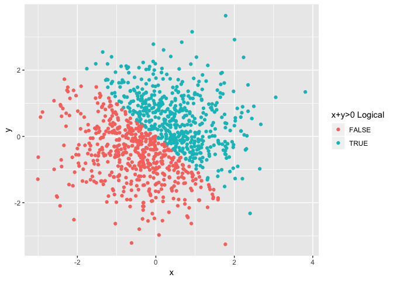
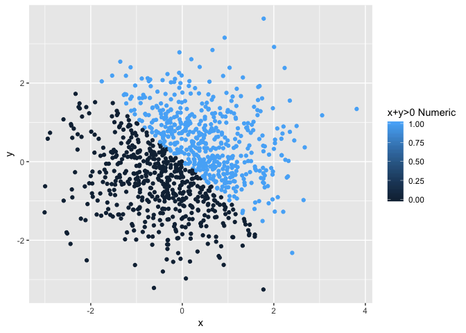
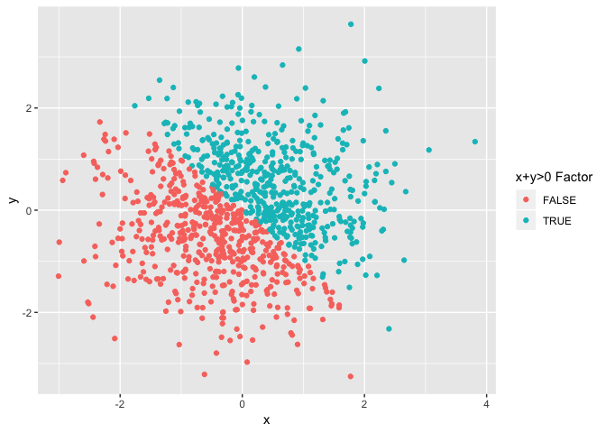

p8105\_hw1\_jl5297
================
Jun Lu
9/13/2018

Executive Summary
-----------------

This my first-week homework for Data Science, including my solutions to Problems 1 and 2. And I'm praciticing using R Markdown to write reproducible reports, GitHub for version control, and R Projects to organize your work through this homework.

Load Packages
-------------

``` r
library(tidyverse)
library(ggplot2)
```

Problem 1
---------

### 1. Create a dataframe

Create a data frame comprised of:

-   A random sample of size 10 from a uniform\[0, 5\] distribution
-   A logical vector indicating whether elements of the sample are greater than 2
-   A (length-10) character vector
-   A (length-10) factor vector

``` r
set.seed(1)
problem1_df = tibble(
    vector_numeric = runif(10, 0, 5),
    vector_logical = vector_numeric > 2,
    vector_character = c("a", "b", "c", "d", "e", "f", "g", "h", "i", "j"),
    vector_factor = factor(c("male", "female", "male","male","male","male","male","male",
                      "male", "female"))
)
```

### 2. Take the mean

Try to take the mean of each variable in the dataframe.

``` r
mean(problem1_df$vector_numeric)
```

    ## [1] 2.757569

``` r
mean(problem1_df$vector_logical)
```

    ## [1] 0.6

``` r
mean(problem1_df$vector_character)
```

    ## Warning in mean.default(problem1_df$vector_character): argument is not
    ## numeric or logical: returning NA

    ## [1] NA

``` r
mean(problem1_df$vector_factor)
```

    ## Warning in mean.default(problem1_df$vector_factor): argument is not numeric
    ## or logical: returning NA

    ## [1] NA

It shows that only numeric and logical variables work. In factor and character, NA is returned. Because taking the mean only can apply to numbers. And a logical variable can be interptred into number, false as 0 and true as 1.

### 3. Convert variables

Convert other variables into numeric

``` r
as.numeric(problem1_df$vector_logical)
as.numeric(problem1_df$vector_character)
as.numeric(problem1_df$vector_factor)
```

Logical and factor variables can easily convert into numeric.
Logical: False become 0 and true become 1.
Factor: Factors convert into integers according to their levels.
As for character, character variables containing only a number can be converted into numeric.

Convert character variable from character to factor to numeric. Convert factor variable from factor to character to numeric.

``` r
as.numeric(as.factor(problem1_df$vector_character))
```

    ##  [1]  1  2  3  4  5  6  7  8  9 10

``` r
as.numeric(as.character(problem1_df$vector_factor))
```

    ## Warning: NAs introduced by coercion

    ##  [1] NA NA NA NA NA NA NA NA NA NA

When converting character variable from character to factor to numeric, it can be turned into a integer. When converting factor variable from factor to character to numeric, NA introduced by coercion.

Problem 2
---------

### 1. Create a dataframe

Create a data frame comprised of:

-   x: a random sample of size 1000 from a standard Normal distribution
-   y: a random sample of size 1000 from a standard Normal distribution
-   A logical vector indicating whether the x + y &gt; 0
-   A numeric vector created by coercing the above logical vector
-   A factor vector created by coercing the above logical vector

``` r
# I have set the seed in chunk p1_dataset
problem2_df = tibble(
    x = rnorm(1000),
    y = rnorm(1000),
    xy_logical = x + y > 0,
    xy_numeric = as.numeric(xy_logical),
    xy_factor = as.factor(xy_logical)
)
```

-   The dataset has 5 columns and 1000 rows.
-   The mean of x is -0.0106382 and median of x is -0.031318.
-   The proportion of cases for which the logical vector is TRUE is 0.49.

### 2. Make scatterplots

Make a scatterplot y vs x; color points using the logical variable.

``` r
ggplot(problem2_df, aes(x = x, y = y, color = xy_logical)) + geom_point() +
    scale_color_discrete(name = "x+y>0")
```



``` r
ggsave("plot1.png")
```

There are only two colors, red and blue, corresponding to two logical variables. And red points and blue points are separated by the line of y = -x.

Make a scatterplot y vs x; color points using the numeric variable.

``` r
ggplot(problem2_df, aes(x = x, y = y, color = xy_numeric)) + geom_point() + 
    scale_color_continuous(name = "x+y>0")
```



``` r
ggsave("plot2.png")
```

The color scale varies between light blue to dark blue. And dark blue points and light blue points are separated by the line of y = -x.

Make a scatterplot y vs x; color points using the factor variable.

``` r
ggplot(problem2_df, aes(x = x, y = y, color = xy_factor)) + geom_point() + 
    scale_color_discrete(name = "x+y>0")
```



``` r
ggsave("plot3.png")
```

There are only two colors, red and blue, corresponding to two factor variables. And red points and blue points are separated by the line of y = -x.
